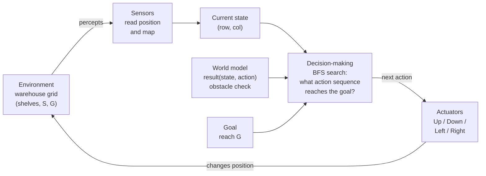

# Lab 1: Constructing a Goal-Based Agent Using a Large Language Model

**Problem:** warehouse navigation. An autonomous vehicle must find a collision-free path from the loading bay `S` to the dispatch area `G`.

## Files

| File | Purpose |
|---|---|
| `warehouse_agent.py` | The goal-based agent (BFS search), well-documented |
| `test_warehouse_agent.py` | 9 unit tests: correctness, shortest path, no-path case, doubled warehouse |
| `sample_output.txt` | Output of `python warehouse_agent.py` |
| `block_diagram.png` | Task 2 block diagram (also drawn in Mermaid below) |
| `test_output.txt` | Output of the test suite |

## How to run

```bash
python warehouse_agent.py                     # solve the warehouse
python -m unittest test_warehouse_agent -v    # run the tests
```

Requires Python 3.x only (no external libraries).

## Result

```
Path found: 20 moves, 55 states expanded

#####################
#S***.#************G#
#.##****##########..#
#....##.............#
#.######.###.#.###..#
#........#..........#
#####################
```

`*` marks the route. The straight-line (Manhattan) distance from S to G is 18 moves. The shelf at row 1, column 6 forces a 2-move detour through row 2, so 20 moves is the shortest possible route. The test suite confirms this with an independent search.

---

## Task 1: Understanding the Problem

**1. What is the environment?**
The warehouse floor, represented as a 7 × 21 two-dimensional grid. Each cell is either free space (`.`), an obstacle such as a shelving unit or outer wall (`#`), the start (`S`) or the goal (`G`). The environment is:
- **fully observable:** the agent has the whole map;
- **deterministic:** a move always takes the vehicle exactly one square in the chosen direction;
- **static:** shelves do not move while the agent is planning;
- **discrete:** finite positions and actions;
- **single-agent:** only one vehicle.

**2. What is the goal of the agent?**
To reach the dispatch area `G` at (row 1, column 19) from the loading bay `S` at (1, 1) without ever entering an obstacle square. Preferably it should do so using as few moves as possible.

**3. What actions are available to the agent?**
Four actions: **Up, Down, Left, Right**. Each moves the vehicle one grid square. An action is only *applicable* if the destination square is free, not a `#`.

**4. What information must the agent maintain in order to choose its next action?**
- Its **current state**: its own (row, column) position.
- Its **goal**: the position of `G`.
- A **model of the world**: the map, and how each action changes its position (the transition model).
- During search, a **frontier** of positions still to explore, a **visited/explored set** so it never revisits a square or loops forever, and **parent pointers** so it can reconstruct the path once the goal is found.
- During execution, the **plan** (remaining action sequence).

**5. Why is this an example of a goal-based agent rather than a simple reflex agent?**
A simple reflex agent chooses an action using only condition–action rules on the current percept (e.g. "if the square to the right is free, move right"). Such an agent has no notion of where it is trying to get to. Here it would walk right from S, hit the shelf at column 6, and either stop or oscillate. It has no way of knowing that it must first move *down* (seemingly away from the goal) to get around the obstacle.

A goal-based agent instead holds an explicit goal and uses its model of the world to consider **future consequences of action sequences**: "if I go Down then Right then Up, where will I be, and does that bring me to G?" It chooses actions because they lie on a path to the goal, not because they match a rule. If the goal changes (a different dispatch bay), the same agent works unchanged, simply with a new goal. A reflex agent would need its rules rewritten.

### Think About It: the warehouse twice as large

**Would the same search strategy still be appropriate?**
Yes, for a warehouse twice as large. I tested this (`test_doubled_warehouse_still_solved`) by tiling the map 2 × 2 into a 12 × 40 grid (about four times the area). BFS still found the shortest path (42 moves) instantly, expanding **247** states compared with **55** for the original map. BFS's cost grows roughly in proportion to the number of free cells. So doubling the dimensions multiplies the work by about four, which is trivial at this scale.

**What additional difficulties might arise?**
- **Scale:** in a real warehouse with millions of cells, BFS explores blindly in every direction. Memory (the frontier and visited set) becomes the bottleneck. An informed search such as **A\*** with the Manhattan-distance heuristic would explore far fewer states while still guaranteeing the shortest path.
- **Non-uniform costs:** turning, reversing or congested aisles may cost more than a straight move. BFS is only optimal when every step costs the same. Uniform-cost search or A\* would be needed.
- **Dynamic environment:** people, forklifts and other vehicles move. A plan computed once may become invalid, so the agent must **sense and re-plan** during execution (e.g. D\* Lite or periodic replanning).
- **Multiple vehicles:** paths must avoid each other in both space and time, which multiplies the state space.
- **Partial observability:** a large vehicle may not have an up-to-date full map and must plan with incomplete or uncertain information.
- **Real-time limits:** the vehicle may need a decision within milliseconds, which favours faster, possibly non-optimal, or anytime algorithms.

---

## Task 2: Designing the Agent

| Component | In this problem |
|---|---|
| **Environment** | The 7 × 21 warehouse grid of free cells and shelves (`Warehouse` class) |
| **Current state** | The vehicle's (row, column) position, initially S = (1, 1) (`agent.state`) |
| **Goal** | G = (1, 19); the goal test is `state == goal` (`agent.goal`, `goal_test`) |
| **Available actions** | Up, Down, Left, Right, each restricted to moves into free cells (`ACTIONS`, `applicable_actions`) |
| **Decision-making component** | Breadth-first search over the transition model `result(state, action)`, producing an action sequence that is then executed step by step (`search`, `run`) |

### Block diagram



Rendered image of the same diagram: [`block_diagram.png`](block_diagram.png).

The same diagram in plain text:

```
             +-------------------------------------------+
             |                 AGENT                     |
 percepts    |  +---------+     +-----------------+      |
 ----------->|  | Sensors |---->|  Current state  |--+   |
 |           |  +---------+     |   (row, col)    |  |   |
 |           |                  +-----------------+  v   |
 |           |  +-----------------+   +----------------+ |
 |           |  |  World model    |-->| Decision-making| |
 |           |  | result(s, a)    |   |  (BFS search): | |
 |           |  | + obstacle test |   | "which actions | |
 |           |  +-----------------+   |  reach goal?"  | |
 |           |  +-----------------+   +----------------+ |
 |           |  | Goal: reach G   |---------^      |     |
 |           |  +-----------------+                v     |
 |           |                        +----------------+ |
 |           |                        |   Actuators    | |
 |           |                        | Up/Down/L/R    | |
 |           |                        +----------------+ |
 |           +-----------------------------------|-------+
 |                                               | action
 |        +--------------------------------+     |
 +--------|  ENVIRONMENT: warehouse grid   |<----+
          +--------------------------------+
```

This follows the goal-based architecture from the lecture. The agent keeps an internal state, asks *"what will the world be like if I do action A?"* using its model, and asks *"will that achieve my goal?"* before choosing an action.

---

## Task 3: Prompt Engineering

### Prompt used

I used **Claude** as the LLM. I extended the suggested prompt from the lab sheet with a few extra requirements, so that the result would be testable and would map clearly onto the design from Task 2:

> Write a well-documented Python program implementing a goal-based agent for the warehouse navigation problem shown below.
>
> ```
> #####################
> #S....#............G#
> #.##....##########..#
> #....##.............#
> #.######.###.#.###..#
> #........#..........#
> #####################
> ```
>
> S is the start, G the goal, # an obstacle and . free space. The vehicle can move Up, Down, Left or Right, one square per move.
>
> The program should
> - represent the warehouse as a two-dimensional grid;
> - determine a collision-free path from S to G;
> - avoid all obstacles;
> - print either the path found or a suitable message if no path exists;
> - explain the search algorithm that has been chosen and why it is appropriate.
>
> Structure the code as a goal-based agent with an explicit environment, current state, goal, set of actions and decision-making (search) component. Use only the Python standard library. Print the list of actions, the list of positions, and the map with the path marked.

### Testing

The generated program (`warehouse_agent.py`) was run and checked as follows:
1. It printed a path of 20 moves and drew it on the map.
2. I checked by hand that the path never enters a `#` and that each step moves exactly one square.
3. I asked for a test suite (`test_warehouse_agent.py`). It checks the path against an *independently written* BFS, a map where no path exists, the case where start equals goal, and a doubled warehouse.

### Answers

**1. Did the LLM generate a working program on the first attempt?**
Yes. The agent program ran correctly on the first attempt and found the optimal 20-move path. The **test file** that the LLM generated afterwards was *not* fully correct the first time. One test (start equals goal) built a tiny map containing no `G`, so the program correctly raised `ValueError: Symbol 'G' not found in the map`, and the test errored. The fault was in the test, not the agent. After the error was fed back, the test was corrected to use a map containing both `S` and `G`, and all 9 tests passed. This shows why LLM output, including its tests, must be run and checked rather than trusted.

**2. If not, how can you improve your prompt?**
Even though the main program worked, the prompt can be improved:
- **Give the exact map and symbols in the prompt** (done above). Without them an LLM may invent its own map or mis-copy the grid.
- **State the coordinate convention and the exact output format**, e.g. "(row, col) with (0, 0) top-left; print the actions, the positions and the map with `*` on the path".
- **Ask for edge cases explicitly**: no path exists, S equals G, malformed map (missing S or G). The test-file bug above came from an edge case that was not specified precisely ("start equals goal" needs a map that still contains a G).
- **Specify the optimality requirement** ("shortest path in number of moves") so the LLM chooses an optimal algorithm rather than, for example, depth-first search.
- **Ask for tests that use an independent check** rather than tests that merely re-run the same code.
- **Iterate**: paste any error message back into the LLM together with the failing code, rather than just saying "it doesn't work".

**3. What search algorithm did the LLM choose?**
**Breadth-First Search (BFS)**, with a FIFO queue, a visited set and parent pointers for path reconstruction.

**4. Why do you think the LLM selected this algorithm?**
- Every move costs the same (1), so BFS is **optimal**: it finds the path with the fewest moves.
- BFS is **complete**: on a finite grid it always finds a path if one exists, and reports failure otherwise. This directly meets the "print the path or a suitable message" requirement.
- The grid is tiny (147 cells), so BFS's main weakness, memory use, is irrelevant.
- BFS is the standard textbook algorithm for shortest paths on unweighted grids. It is simple and easy to explain and verify, and it is extremely common in the code an LLM has been trained on, which makes it the most probable choice.
- Depth-first search would not guarantee the shortest route. A\* would also work, and would scale better (see *Think About It*), but its extra complexity buys nothing on a map this small.

### Critical evaluation of LLM-assisted development

**Strengths**
- Produced clean, documented, runnable code almost instantly.
- Made sensible design decisions (BFS, visited set) and explained them.

**Limitations**
- Output still had to be **tested**: the test file contained a bug.
- An LLM can sound confident about code that is wrong.
- Its algorithm choice reflects what is common in its training data, not necessarily what is best for a larger problem.
- The developer remains responsible for specifying the problem precisely, checking correctness (e.g. path optimality) and judging whether the solution scales.
