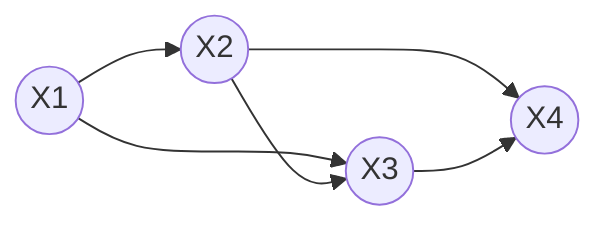

# Lab 4: Bayesian Networks and Autoregressive Language Models

First- and second-order autoregressive (n-gram) language models, built from counts, viewed as Bayesian networks, and tested against their probabilistic specification.

## Files (deliverables)

| Deliverable | File |
|---|---|
| 1. First-order model | [`first_order_lm.py`](first_order_lm.py) |
| 2. Second-order model | [`second_order_lm.py`](second_order_lm.py) |
| 3. CPTs for selected contexts | [`results/cpt_tables.md`](results/cpt_tables.md), [`results/predictions.md`](results/predictions.md) |
| 4. Generated text | [`results/generated_first_order.txt`](results/generated_first_order.txt), [`results/generated_second_order.txt`](results/generated_second_order.txt) (25 sentences each), [`results/greedy_vs_sampling.md`](results/greedy_vs_sampling.md) |
| 5. Normalisation tests | [`results/normalisation_test.txt`](results/normalisation_test.txt), [`test_models.py`](test_models.py) (20 tests; output in `test_output.txt`) |
| 6. Answers to Questions 1–14 | this README |
| 7. Reflection on the LLM | this README, §Reflection |
| Other | `data.py` (dataset and tokeniser), `experiments.py` (regenerates everything in `results/`), [`results/model_comparison.md`](results/model_comparison.md) |

## How to reproduce

Python 3 only. No ML libraries, no pretrained models.

```bash
python first_order_lm.py           # CPTs, prediction, sampled + greedy sentences
python second_order_lm.py
python experiments.py              # regenerates every file in results/ (random seed 2026)
python -m unittest test_models -v  # 20 tests
```

## Dataset (Part III)

The six sentences from the sheet, lower-cased, one token per word, wrapped in `<START>` … `<END>`:

```
<START> the cat sat on the mat <END>
<START> the cat sat on the rug <END>
<START> the dog sat on the mat <END>
<START> the dog ran to the park <END>
<START> the cat ran to the park <END>
<START> the dog sat on the rug <END>
```

Vocabulary: 10 words (the, cat, dog, sat, ran, on, to, mat, rug, park), plus `<START>`, which can only be a context, and `<END>`, which can only be an outcome.

---

## Part I

### Question 1: Why is the autoregressive decomposition useful for generating text?

The chain rule turns one enormous, intractable object, the joint distribution P(X1, …, XT) over all possible sentences, into a **product of next-word distributions**. Each factor answers a single, local question: *given the words so far, what is the next word?* This gives a direct recipe for generation:
1. sample X1 from P(X1);
2. sample X2 from P(X2 | X1);
3. sample X3 from P(X3 | X1, X2);
4. and so on, until `<END>` is produced.

Each step needs only one distribution over the vocabulary, never a distribution over whole sentences. And because the decomposition is *exact* (it is just the chain rule), sampling word by word produces sentences with exactly the probabilities of the joint distribution. It also matches the left-to-right order in which text is written or spoken. Variable-length sentences are handled naturally: generation stops when `<END>` is sampled. The same factorisation also lets us *score* any sentence by multiplying its factors.

---

## Part II

**Bayesian network for the first-order model:**


P(X1, X2, X3, X4) = P(X1) P(X2 | X1) P(X3 | X2) P(X4 | X3)

### Question 2: What independence assumption is made by this network?

The **first-order Markov assumption**: given the immediately preceding word, a word is conditionally independent of all earlier words.

  **P(Xt | X1, X2, …, Xt−1) = P(Xt | Xt−1)**   for every t ≥ 2

or equivalently   **Xt ⊥ {X1, …, Xt−2} | Xt−1**.

In Bayesian-network terms, each node is independent of its non-descendants given its parent. Each node Xt has a single parent, Xt−1. So once Xt−1 is known, X1, …, Xt−2 carry no further information about Xt. For example, P(X5 | X1 = the, X2 = cat, X3 = sat, X4 = on) = P(X5 | X4 = on).

---

## Part IV

### Question 3: Conditional distribution P(next word | current word)

Computed from the counts with P(wj | wi) = C(wi, wj) / Σk C(wi, wk). The full table is in `results/cpt_tables.md`.

| current word | P(next \| current) | zero-probability next tokens |
|---|---|---|
| **the** (12 occurrences) | cat 3/12 = **0.250**, dog 3/12 = **0.250**, mat 2/12 = 0.167, rug 2/12 = 0.167, park 2/12 = 0.167 | the, sat, ran, on, to, `<END>` |
| **cat** (3) | sat 2/3 = **0.667**, ran 1/3 = 0.333 | all others (the, cat, dog, on, to, mat, rug, park, `<END>`) |
| **dog** (3) | sat 2/3 = **0.667**, ran 1/3 = 0.333 | all others |
| **sat** (4) | on 4/4 = **1.000** | all others |
| **ran** (2) | to 2/2 = **1.000** | all others |
| on (4) | the 4/4 = 1.000 | all others |
| to (2) | the 2/2 = 1.000 | all others |
| mat, rug, park (2 each) | `<END>` = 1.000 | all words |
| `<START>` (6) | the 6/6 = 1.000 | all others |

Note: in this dataset "the cat" and "the dog" each occur **3** times (the sheet's "3 times and twice" was only an illustration), so P(cat | the) = P(dog | the) = 0.25. Each of the 6 sentences contains "the" twice, so C(the, ·) = 12.

**Zero-probability transitions.** Of the 11 × 11 = 121 possible (context, next) pairs, only **17** have non-zero probability; the other **104** are zero. Important examples:
- P(sat | the) = 0 and P(ran | the) = 0. So any sentence with "the sat" gets probability 0.
- P(`<END>` | the) = 0, P(`<END>` | cat) = 0, P(`<END>` | sat) = 0. A sentence can only end after mat, rug or park.
- P(the | the) = 0, P(cat | dog) = 0, P(mat | cat) = 0.
- Each of sat, ran, on, to, `<START>`, mat, rug and park has a **deterministic** row: exactly one possible successor.

Some of these zeros are "correct" (grammar forbids "the the"). Others only reflect the small data: "the cat sat on the sofa" gets probability 0 simply because "sofa" never occurs. This gets much worse in the second-order model, where (to, the) has only ever been followed by "park", so the perfectly good sentence "the dog ran to the mat" gets probability 0.

---

## Part V: prompt used with the LLM (Claude)

> Write a simple Python implementation of a first-order autoregressive language model. The model should:
> 1. take a list of tokenised sentences as training data;
> 2. count transitions between consecutive tokens;
> 3. construct the conditional distribution P(Xt | Xt−1);
> 4. display the probabilities for a specified previous token;
> 5. predict the most probable next token;
> 6. generate a sentence by repeatedly sampling the next token;
> 7. stop when the `<END>` token is generated.
>
> Do not use a machine-learning library or a pretrained language model. Use ordinary Python data structures and random sampling.
> Add `<START>` and `<END>` tokens to each sentence. Use this training data: [the six sentences].

Follow-up prompts:
- *"Add a greedy mode that always chooses argmax P(w | previous), alongside the sampling mode. Break ties deterministically."*
- *"Add a function that computes the probability of a whole sentence using the chain rule."*
- *"What happens if generation reaches a token with no observed successor? Handle it explicitly."*
- (Part XII) *"Modify the existing first-order autoregressive model into a second-order model. The model should estimate P(Xt | Xt−2, Xt−1). Represent the model using counts of observed triples and use these counts to construct conditional probability distributions. Do not replace the model with a neural network or a pretrained language model."*

---

## Part VI: inspecting the generated code

### Question 4: Where are the transition counts stored?

In `FirstOrderLM.counts`, a `defaultdict(Counter)` where `counts[previous][next]` = C(previous, next). It is filled in `train()`. Each sentence is padded to `[<START>] + tokens + [<END>]`, and every consecutive pair is counted with `self.counts[prev][nxt] += 1`. In the second-order model, `SecondOrderLM.counts[(u, v)][w]` = C(u, v, w) stores triples.

### Question 5: Where is P(Xt | Xt−1) computed?

At the end of `train()`, where each row of counts is normalised:

```python
self.probs = {
    prev: {nxt: c / sum(row.values()) for nxt, c in row.items()}
    for prev, row in self.counts.items()
}
```

i.e. P(next | prev) = C(prev, next) / Σk C(prev, k). It is stored in `self.probs[prev][next]` and read through `distribution(prev)`.

### Question 6: How does the program choose the next word? Always the most probable, or sampling?

**Both, selected by the `mode` argument of `next_token()` / `generate()`.**
- `mode="sample"` (the default, as the prompt required) **samples** from the distribution: `rng.choices(words, weights=[P(w|prev) …])`. A word with probability 0.25 is chosen about 25% of the time. `test_sampling_frequencies_match_cpt` checks this over 60,000 draws.
- `mode="greedy"` **always picks the most probable word**, argmax P(w | prev), through `predict()`, with ties broken alphabetically.

**The difference.** Greedy decoding is deterministic: the same context always gives the same word, so it always produces the same sentence, and only the single most likely continuation of each word is ever explored. Sampling is stochastic. It produces every continuation in proportion to its probability, so repeated runs give different sentences, and the *distribution* of generated sentences matches the model's joint distribution P(X1, …, XT). Greedy decoding does **not** sample from the model: it ignores all the probability mass that is not on the top word. Here this even makes it fail to terminate (Question 10).

### Question 7: What happens if the program meets a word with no observed transition?

That word has no row in the CPT, so P(· | w) is undefined: there is no distribution to sample from. In this implementation `distribution(w)` returns `{}`, `predict(w)` returns `(None, 0.0, [])`, and `next_token()` returns `None`. `generate()` then stops and reports status `"unseen"`, rather than crashing or inventing a word. (A naive implementation that indexes `probs[word]` directly would crash with a `KeyError`.) Similarly, `sentence_probability()` returns 0 for any sentence containing an unobserved transition.

In this dataset, every vocabulary word happens to be observed as a context. The case arises for an out-of-vocabulary word such as "elephant", for any unseen *pair* in the second-order model (96 of its 111 possible contexts), and for any observed context followed by an unobserved word (e.g. "the sat"). The general cure is **smoothing** (e.g. add-one/Laplace, or backing off to a lower-order model), which gives unseen events a small non-zero probability.

---

## Part VII: testing the probability model

The check from the sheet, applied to both models (`results/normalisation_test.txt`):

```
First-order model:  sum_v P(v | w)
  <START>    1.000000
  the        1.000000
  cat        1.000000
  sat        1.000000
  on         1.000000
  mat        1.000000
  rug        1.000000
  dog        1.000000
  ran        1.000000
  to         1.000000
  park       1.000000

Second-order model: all 15 observed contexts -> 1.000000
All rows sum to 1: True
```

The test suite goes further than the sheet's check (`test_models.py`, 20 tests, all passing):
- every row sums to 1 (to 12 decimal places) and every probability is in (0, 1];
- counts and probabilities match hand calculations (e.g. P(cat | the) = 3/12);
- the probability of a sentence equals the hand-computed chain-rule product;
- the model defines a proper distribution over *whole sentences*: summing P(sentence) over all sentences up to 40 words gives > 0.999;
- the sampler's empirical frequencies match the CPT within 5 standard errors, and it never produces an unseen word;
- **negative control**: a deliberately buggy implementation (smoothing applied to the numerators of the observed words only) *fails* the normalisation check. This shows the test can actually detect errors.

### Question 8: If one of the totals is 0.87, what does that tell you?

The implementation is **wrong**: that row is not a probability distribution. 13% of the probability mass for that context is missing, so the code does not implement the specified model P(Xt | Xt−1) = C(xt−1, xt) / Σk C(xt−1, k). (Floating-point error is of order 10⁻¹⁶, not 0.13.) Likely causes:
- dividing by the wrong denominator, e.g. the total number of times the word occurs anywhere, instead of the number of times it is *followed* by something;
- missing some successors, e.g. not counting `<END>` transitions, or dropping the last pair of each sentence through an off-by-one loop;
- smoothing applied inconsistently (numerator and denominator not adjusted together, the bug used in the negative-control test);
- probabilities rounded or truncated before being stored, or a filter that removes rare successors without renormalising.

A worrying point: `random.choices` normalises its weights internally. So a model with rows summing to 0.87 would still *generate* plausible-looking text, while every probability it reports, and every sentence score, would be wrong. Only testing the invariant reveals the problem.

---

## Part VIII

### Next-word predictions (`results/predictions.md`)

| Previous word | P(Xt+1 \| Xt) | argmax | P(argmax) |
|---|---|---|---|
| `<START>` | the 1.000 | the | 1.000 |
| **the** | cat 0.250, dog 0.250, mat 0.167, park 0.167, rug 0.167 | **cat** (tied with dog) | 0.250 |
| cat | sat 0.667, ran 0.333 | sat | 0.667 |
| dog | sat 0.667, ran 0.333 | sat | 0.667 |
| sat | on 1.000 | on | 1.000 |
| ran | to 1.000 | to | 1.000 |
| on | the 1.000 | the | 1.000 |
| to | the 1.000 | the | 1.000 |
| mat | `<END>` 1.000 | `<END>` | 1.000 |
| elephant | (never observed) | – | – |

arg max_w P(w | the) is **a tie between cat and dog** (0.25 each). The code reports both and returns "cat" by its alphabetical tie-break rule.

### Question 9: Are the most probable predictions always what you would personally expect? What does this say about a probability model vs human linguistic expectations?

**No.**
- After "the", the model predicts "cat" (tied with "dog") in *every* position. But in "the cat sat on the ___" I would expect "mat" or "rug", not "cat". A first-order model only sees the single previous word "the", so it cannot tell the subject position from the object position.
- The model is certain that "mat" ends the sentence (P(`<END>` | mat) = 1). I know "the cat sat on the mat **in the kitchen**" is fine.
- The model says P(sat | the) = 0. So it considers "the sat" impossible, which is correct, but it equally considers "the cat sat on the sofa" impossible, simply because "sofa" was never seen.
- Strikingly, the model rates **"the rug"** (P = 1/6 ≈ 0.167) as **six times more probable than "the cat sat on the mat"** (P ≈ 0.028), a sentence it was actually trained on. No human would consider "the rug" the most likely sentence.

This shows that a probability model's "expectations" are only **relative frequencies in its training data, filtered through its independence assumptions**. It has no meaning, grammar or world knowledge, and here it sees only one word of context and six sentences of data. Human expectations draw on long context, syntax ("the" begins a noun phrase that must still fit the sentence), semantics (cats sit on mats), and a lifetime of language. The model's predictions are only as good as its *data* and its *structure*. Where they disagree with human intuition, that points either to too little data or to an independence assumption that is too strong.

---

## Part IX: generated text

25 sentences sampled from each model (seed 2026) are in `results/generated_first_order.txt` and `results/generated_second_order.txt`. First 12 from the **first-order** model:

```
 1. the rug                                    [NEW; P = 0.167]
 2. the cat sat on the dog sat on the dog sat on the cat ran to the dog ran to the park   [NEW; P = 5.36e-06]
 3. the park                                   [NEW; P = 0.167]
 4. the mat                                    [NEW]
 5. the rug                                    [NEW]
 6. the rug                                    [NEW]
 7. the mat                                    [NEW]
 8. the dog sat on the dog sat on the mat      [NEW; P = 0.0046]
 9. the rug                                    [NEW]
10. the cat sat on the park                    [NEW; P = 0.0278]
11. the rug                                    [NEW]
12. the park                                   [NEW]
...
18. the dog sat on the rug                     [in training data]
20. the dog sat on the mat                     [in training data]
21. the dog ran to the park                    [in training data]
```

Generation follows X1 ~ P(X1 | `<START>`), X2 ~ P(X2 | X1), …, i.e. *sample → append token → sample again*, until `<END>` is drawn.

---

## Part X: deterministic vs probabilistic generation (`results/greedy_vs_sampling.md`)

**First-order, Mode A (greedy), 5 runs:** all identical, and **none terminates**:

```
the cat sat on the cat sat on the cat sat on the cat sat on the cat sat on ...   [stopped at 30 tokens]
(same output 5 times)
```

**First-order, Mode B (sampling), 5 runs:**

```
the rug
the cat sat on the dog sat on the dog sat on the cat ran to the dog ran to the park
the park
the mat
the rug
```

**Second-order, greedy, 5 runs:** `the cat sat on the mat` (all 5 identical).
**Second-order, sampling, 5 runs:** the dog sat on the mat / the dog sat on the rug / the dog sat on the rug / the cat sat on the rug / the cat sat on the mat.

### Question 10: Which mode produces more variation? Why?

**Sampling** produces far more variation. Over 10,000 first-order samples there were 787 distinct sentences, while greedy decoding produces *exactly one* output however often it is run. Greedy decoding is a deterministic function of the context: arg max P(w | previous) is always the same word, so the whole sentence is always the same. Sampling draws each word at random in proportion to its probability, so every word with non-zero probability can appear. The variation reflects the uncertainty that the model actually represents.

Greedy decoding also shows a known failure: **repetition loops**. The argmax chain the → cat → sat → on → the is a cycle, and P(`<END>` | ·) is never the largest probability on it, so the first-order greedy generator never produces `<END>`. Only the 30-token safety limit stops it. Sampling escapes because at "the" it eventually draws mat, rug or park, which lead to `<END>`. With two words of context, the second-order model knows that "on the" is followed by mat or rug, so even greedy decoding terminates.

---

## Part XI: the second-order Bayesian network



P(X1, X2, X3, X4) = P(X1) P(X2 | X1) P(X3 | X1, X2) P(X4 | X2, X3)

In the code, the sentence is padded with two `<START>` tokens, so that P(X1) = P(X1 | `<START>`, `<START>`) and P(X2 | X1) = P(X2 | `<START>`, X1).

### Question 11: How does the second-order model differ from the first-order model?

1. **Graph structure.** First-order: a chain. Each Xt has **one** parent (Xt−1), and there are T−1 edges. Second-order: each Xt (t ≥ 3) has **two** parents (Xt−2 and Xt−1), giving the extra "skip" edges Xt−2 → Xt. The independence assumption weakens from Xt ⊥ X1..t−2 | Xt−1 to **Xt ⊥ X1..t−3 | Xt−2, Xt−1**.
2. **Conditional probability table.** First-order: one row per single previous word, i.e. 11 possible contexts × 11 outcomes = 121 entries (110 free parameters). Second-order: one row per **pair** of previous words, i.e. 111 possible contexts (1 + 10 + 100) × 11 outcomes = 1,221 entries (1,110 free parameters). That is roughly V times larger, and in general the table grows as V^(n+1).
3. **Context available for prediction.** First-order sees 1 word, second-order sees 2. This lets it distinguish situations the first-order model merges: P(· | on, the) = {mat 0.5, rug 0.5}, but P(· | to, the) = {park 1.0}. The first-order model gives the same P(· | the) in both positions, including "cat" and "dog".
4. **Amount of data needed.** Many more contexts need to be observed, each enough times to estimate its row. With the same six sentences, only **15 of the 111** possible pair contexts are ever observed (86% have no data), compared with 11 of 11 for the first-order model. The second-order model needs far more data before it becomes reliable.

---

## Part XII: second-order implementation

**What should change in the probabilistic model (stated before accepting the LLM's code):**
- The context must become the **pair** (Xt−2, Xt−1), so the CPT has one row per pair.
- The counts must become **triples** C(u, v, w), normalised as P(w | u, v) = C(u, v, w) / Σk C(u, v, k).
- Sentences must be padded with **two** `<START>` tokens, so the first two words also have a two-token context.
- During generation, the context window must **slide**: (u, v) ← (v, w).
- Sampling, greedy choice and stopping at `<END>` stay exactly the same. **Only the conditioning set changes.**

**Inspection and testing.** The generated `second_order_lm.py` was checked against this list. The tests confirm:
- the triple counts match hand counts (e.g. C(on, the, mat) = 2);
- every row sums to 1;
- the context really has two tokens (P(· | on, the) ≠ P(· | to, the));
- the sentence probability equals the hand-computed chain product;
- greedy generation terminates with "the cat sat on the mat";
- unseen pair contexts are handled without crashing.

---

## Part XIII: comparing the two models (`results/model_comparison.md`)

| Measure | First-order | Second-order |
|---|---|---|
| Possible contexts | 11 | 111 |
| Full CPT size (contexts × 11 outcomes) | 121 | 1,221 |
| **Distinct free parameters** (rows sum to 1) | **110** | **1,110** |
| Non-zero parameters actually estimated (distinct n-grams seen) | 17 | 19 |
| Observed contexts | 11 | 15 |
| **Zero-probability (unobserved) contexts** | **0** | **96** (86%) |
| **Diversity**: distinct sentences in 10,000 samples | **787** | **6** |
| Distinct sentences *not* in the training data | 781 | **0** |
| Fraction of samples that are new sentences | 85.9% | 0.0% |
| Mean / min / max length (words) | 6.07 / 2 / 50 | 6.00 / 6 / 6 |

**Qualitative coherence, with examples.**

First-order: very diverse but often **incoherent or truncated**.
- *the rug*, *the mat*, *the park*: **49%** of all samples are these two-word "sentences". They are reached whenever "the" is followed by mat, rug or park immediately after `<START>`.
- *the cat sat on the park*, *the dog ran to the mat*: grammatical but semantically odd.
- *the cat sat on the dog sat on the dog sat on the cat ran to the dog ran to the park*: run-on, with no memory of having already used a verb.
- Some outputs are fine new sentences, e.g. *the cat ran to the mat*.

Second-order: **perfectly coherent but no novelty**. All 10,000 samples are one of the six training sentences, each about 1/6 of the time:

```
the cat sat on the rug   (1694 times)    the dog ran to the park  (1642)
the cat ran to the park  (1690)          the dog sat on the rug   (1634)
the cat sat on the mat   (1675)          the dog sat on the mat   (1665)
```

**Probability of selected sentences:**

| Sentence | In training? | P first-order | P second-order |
|---|---|---|---|
| the cat sat on the mat | yes | 0.0278 | 0.1667 |
| the dog ran to the park | yes | 0.0139 | 0.1667 |
| the cat ran to the mat | no | 0.0139 | **0** |
| the dog sat on the park | no | 0.0278 | **0** |
| the rug | no | **0.1667** | 0 |
| the cat sat on the dog ran to the park | no | 0.0023 | 0 |

The first-order model **over-generalises**: it gives "the rug" the highest probability of any sentence. The second-order model **memorises**: it gives the *reasonable* new sentence "the cat ran to the mat" probability zero, because the context (to, the) was only ever followed by "park". This is the bias–variance trade-off in miniature.

### Question 12: Why can more context improve prediction, and why can it make the model harder to estimate from limited data? Relate this to the size of the CPT.

**Why more context helps.** Real language has long-range dependencies. The best next word depends on more than one previous word. With more context, the model can separate situations that a shorter context lumps together. "on the" → mat/rug while "to the" → park; the first-order model can only see "the" in both. The Markov assumption becomes less wrong, so the model's conditional distributions get closer to the true P(Xt | X1, …, Xt−1). Here this removed the incoherent outputs: no "the rug", no "sat on the park", and greedy decoding terminates.

**Why it makes estimation harder.** Each extra word of context multiplies the number of CPT rows by the vocabulary size V. With V = 10 words, there are 11 contexts for first-order and 111 for second-order, and V^n in general. A realistic vocabulary of 50,000 words would give 2.5 × 10⁹ pair contexts and 1.25 × 10¹⁴ triple contexts, each with a 50,000-entry row. The amount of training data does *not* grow with the table. So most rows are never observed (here 96 of 111), and the observed rows are estimated from very few examples (several from a single occurrence: (cat, ran) and (dog, ran) were each seen once). The estimates become extreme (many probabilities of exactly 1 or 0), the model **overfits** and reproduces its training data, and it assigns zero probability to perfectly good new sentences. More context means lower bias but higher variance: more parameters to estimate from the same data. This **data-sparsity problem**, the curse of dimensionality for n-grams, is why practical n-gram models need smoothing and back-off. It is also why neural networks, which *share* parameters across contexts instead of storing one row per context, are used to model long contexts.

---

## Part XIV: connection to modern language models

The objective is the same, P(x1, …, xT) = Π P(xt | x1, …, xt−1) with the first factor P(x1 | `<START>`), but the CPT is replaced by a neural network that maps the whole context to a distribution over the next token. A neural model also uses a softmax output, which sums to 1 by construction: the same normalisation property tested here. It can also be decoded greedily or by sampling, with the same trade-offs observed in Part X (greedy decoding in LLMs is also known to fall into repetition loops).

---

## Part XV

### Question 13: Why is Approach B preferable to Approach A when building an intelligent system?

Approach A ("write a Python language model for me") hands every important decision to the LLM: what the model is, what it conditions on, how it is estimated, and how text is generated. The result might be a bigram model, a trigram model, a call to a pretrained library, or a neural network, and the user cannot judge whether it is right because "right" was never defined. Approach B ("implement P(Xt | Xt−1), estimated from transition counts, with sampling-based generation") makes the model explicit *before* any code exists.

- **Specifying the intended behaviour.** A specification is a definition of correctness. It tells the LLM exactly what to build (counts → normalised CPT → sampling until `<END>`), and it gives the engineer a checklist to review against. In this lab, the specification made it obvious which parts had to be tested.
- **Understanding the representation.** Knowing that the model is a table of P(next | previous) built from counts lets the engineer read the code and find where counts live (Q4), where probabilities are computed (Q5), how choices are made (Q6), and what happens with unseen words (Q7). It also lets them predict behaviour, e.g. that greedy decoding will loop on the → cat → sat → on → the.
- **Validating the generated implementation.** Code that runs and produces sentences can still be wrong. The output was checked against hand-computed counts and probabilities and against chain-rule sentence probabilities. The second-order code was checked against the list of changes stated in advance.
- **Testing probabilistic invariants.** A probabilistic program cannot be tested by comparing its output to one "expected" sentence, because its output is random. Instead, test properties that *must* hold if the model is correct: rows sum to 1, probabilities lie in [0, 1], sampled frequencies match the CPT, and the sentence distribution sums to 1. The negative control shows these tests catch real bugs that generation alone would hide.
- **Distinguishing implementation from model.** The *model* is the probability distribution, P(Xt | Xt−1) with the Markov assumption. The *implementation* is how it is stored and computed (dictionaries, Counters, `random.choices`). They can fail separately. An implementation bug (rows summing to 0.87) is fixed in the code. A model limitation (zero probability for "the cat ran to the mat", or "the rug" being most likely) is not a bug: the code faithfully implements a model whose assumptions or data are inadequate. Telling these apart is only possible if the model was specified first.

---

## Question 14: What did thinking of the language model as a Bayesian network give you?

- **A representation of dependencies.** The graph X1 → X2 → X3 → … makes it explicit, at a glance, which words each prediction depends on. The second-order graph shows exactly what changes when each node gains a second parent.
- **A factorisation of the joint distribution.** The network says the joint distribution is the product of one local CPT per node. This turns an impossible-to-estimate distribution over all sentences into 11 small tables that can be filled by counting. It also gives a way to score whole sentences (the rug = 1 × 2/12 × 1).
- **A way of interpreting conditional probabilities.** Each CPT row is a precise, inspectable statement such as "after 'cat', 'sat' follows with probability 2/3". Every parameter has a meaning and can be checked against the data by hand.
- **A principled method for generation.** Ancestral sampling, sampling each node given its parents in topological order, is the general BN sampling algorithm. Applied to the chain, it *is* autoregressive text generation, and it is guaranteed to produce sentences with the model's joint probabilities.
- **A way to reason about independence assumptions.** The graph states the assumption Xt ⊥ X1..t−2 | Xt−1 explicitly. That explains *why* the model fails (it cannot tell "sat on the ___" from "the ___") and what to change to fix it.
- **A way to understand the effect of increasing context.** Adding parents to a node multiplies the size of its CPT by V. That explains in one line why the second-order model is more coherent yet has 96 unobserved contexts and only memorises the data.
- **A way to test whether an implementation matches its specification.** The BN defines exactly what the code should compute. So we could write tests with known answers: CPT rows sum to 1, counts match the data, sentence probability equals the product of CPT entries, and sampled frequencies match the CPT. These tests caught issues that "the output looks like English" never would.

---

## Reflection: how the LLM was used and how its output was validated

**How the LLM was used.**
- I wrote the specification first: the variables, the Markov assumption, CPTs from counts, and sampling until `<END>`.
- The LLM (Claude) then generated the first-order model from the Part V prompt, added greedy mode and sentence probabilities on request, and converted the model to second order from the Part XII prompt.
- It also helped draft the test suite and the experiment script.

**How the output was validated.** By hand calculation of the CPTs (Q3) compared with the program's tables; by the normalisation tests, including a negative control; by sentence probabilities compared with hand-computed chain products; by statistical tests of the sampler; and by checking the second-order code against the list of required changes stated in advance.

**Example of LLM-generated code that was inspected and corrected: the greedy generation loop.** The direct implementation of the specification ("choose the argmax; stop when `<END>` is generated"), which is the form an LLM typically produces for this prompt, is:

```python
def generate_greedy(probs):
    token, sentence = START, []
    while token != END:
        token = max(probs[token], key=probs[token].get)
        if token != END:
            sentence.append(token)
    return " ".join(sentence)
```

It *looks* correct: "stop when `<END>` is generated" exactly as specified. On inspection it has two problems:
1. **It never terminates on this data.** max() picks "cat" after "the" (tied with "dog", and first in insertion order). The argmax chain then cycles: the → cat → sat → on → the → cat → … `<END>` is never the most probable token on this cycle. Running this version on the training data confirmed it: the process hung and had to be killed by a 5-second timeout, with no output.
2. **It crashes on an unseen token** (`probs[token]` raises `KeyError`), and **ties are broken by dictionary insertion order**, which is arbitrary and undocumented.

**Correction** (now in `first_order_lm.py`):
- `generate()` takes a `max_tokens` limit and returns a status (`end`, `max_tokens` or `unseen`), so the caller can see *why* generation stopped;
- `next_token()` returns `None` for an unseen context instead of raising;
- `predict()` breaks ties alphabetically and reports the tied words.

The tests `test_first_order_greedy_never_reaches_end` and `test_unseen_word_has_no_distribution` lock this behaviour in. The lesson: the specification said "stop when `<END>` is generated", but did not say what to do if `<END>` is never generated. The LLM implemented the specification literally, and only running the code against known data exposed the gap.

**A second inspection point.** When moving to the second-order model, the padding had to be checked explicitly. Sentences need *two* `<START>` tokens: with only one, the first word has no full pair context, and the factorisation in Part XI is not implemented correctly. The generated code was inspected for this, and the test `test_sentence_probability` confirms that the first factor is P(the | `<START>`, `<START>`) = 1 and the second P(cat | `<START>`, the) = 0.5.
