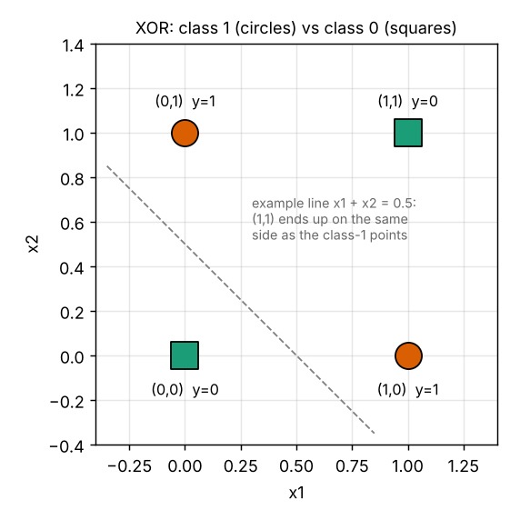
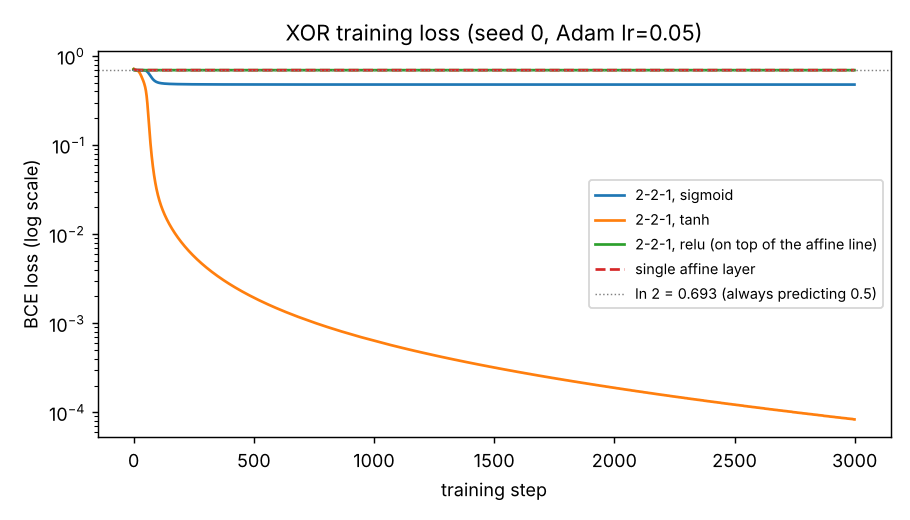

# Lab 5: Neural Models (Learning, Depth, Activations and Output Layers)

**Scenario:** two redundant binary safety sensors. A disagreement warning must be raised exactly when one sensor is active and the other is not, which is the XOR function.

## Files

| File | Contents |
|---|---|
| `xor_first_implementation.py` | Task 3: the LLM's first implementation (2-2-1, tanh, BCEWithLogitsLoss), with the two changes made before execution marked |
| `xor_experiments.py` | **Final binary XOR code**: Task 1 linear baselines, and Task 4 Parts A (learning), B (gradients), C (symmetry) and D (activations) |
| `three_class.py` | **Final three-class extension** (Task 5) |
| `test_neural.py` | 10 verification tests (all pass, see `results/test_output.txt`) |
| `make_xor_sketch.py` | Draws the Task 1 sketch |
| `results/` | Full program outputs (`xor_experiments_output.txt`, `three_class_output.txt`, `first_implementation_output.txt`), `loss_curves.png`, `xor_points.png` |

## How to reproduce

Requires Python 3, NumPy and PyTorch (CPU). Matplotlib is used for the figures.

```bash
pip install torch numpy matplotlib
python xor_first_implementation.py     # Task 3 (a few seconds)
python xor_experiments.py              # Task 1 check + Task 4 A–D (about 3 min, mostly the 150 repeated runs)
python three_class.py                  # Task 5
python make_xor_sketch.py              # Task 1 figure
python -m unittest test_neural -v      # tests
```

**Settings for every run unless stated:** `torch.manual_seed(0)`, PyTorch's default `nn.Linear` initialisation, full-batch **Adam, learning rate 0.05, 3000 steps**, threshold 0.5. Results are from PyTorch 2.14 (CPU). Exact numbers can differ slightly between PyTorch versions.

---

## Task 1: Understanding the problem before coding

**1. Specification.**
- Input space: **X = {0, 1}²** (two binary sensors, x1 and x2).
- Output space: **Y = {0, 1}** (1 = disagreement warning).
- The four labelled examples are the whole of X:

| x1 | x2 | y |
|---|---|---|
| 0 | 0 | 0 |
| 0 | 1 | 1 |
| 1 | 0 | 1 |
| 1 | 1 | 0 |

The agent must compute y = x1 XOR x2, i.e. output P(y = 1 | x) close to 1 exactly when x1 ≠ x2, so that a threshold at 0.5 gives the correct label for all four inputs.

**2. Sketch.**



The class-1 points (0,1) and (1,0) lie on one diagonal of the unit square. The class-0 points (0,0) and (1,1) lie on the other.

**3. Why one straight boundary cannot separate the classes.** A linear classifier puts class 1 on one side of a line w1·x1 + w2·x2 + b = 0. Requiring (0,1) and (1,0) to be on the positive side and (0,0) and (1,1) on the negative side gives b < 0, w2 + b > 0, w1 + b > 0 and w1 + w2 + b < 0. Adding the middle two gives w1 + w2 + 2b > 0, so w1 + w2 + b > −b > 0, which contradicts the last condition. The two classes sit on crossing diagonals, so every line leaves at least one point on the wrong side.

**4. Prediction for a single affine map + sigmoid.** It cannot classify all four points correctly. By symmetry, the best it can do under cross-entropy is to predict **P = 0.5 for every input**, giving a loss of **ln 2 ≈ 0.693**. At most 2 or 3 points can be on the right side of any line, and the threshold then labels all four identically, so at most 2 of 4 are correct.

**Checked by experiment** (`xor_experiments.py`, Task 1 check):

| Model | Initial loss | Final loss | Predictions | Correct |
|---|---|---|---|---|
| Single affine layer + sigmoid | 0.7168 | **0.6931** (= ln 2) | 0.5000 for all four inputs | 2/4 |
| 2-2-1 with **identity** hidden activation (affine depth only) | 0.7078 | **0.6931** | 0.5000 for all four inputs | 2/4 |

The prediction was confirmed exactly. Adding a hidden *layer* without a nonlinearity changes nothing: W2(W1x + b1) + b2 is still a single affine map.

**Think About It: what scientific claim can XOR test with four points?** The claim that **the kind of representation, not the number of parameters, decides what a model can compute**. A model whose function class is affine cannot represent XOR, however many affine layers or parameters it has. A model with even two *nonlinear* hidden units can, because the hidden layer can re-represent the inputs (e.g. one unit for "at least one sensor on" and one for "both on") so that the classes become linearly separable in hidden space. Four points are enough to falsify "a deep linear network can learn this" and to support "a nonlinear hidden representation is necessary and sufficient here".

---

## Task 2: Design of the agent

**Model specification** (written before asking the LLM):
- Architecture **2 → 2 → 1**: h = f(W⁽¹⁾x + b⁽¹⁾), with W⁽¹⁾ of shape 2 × 2 and b⁽¹⁾ of length 2; z = W⁽²⁾h + b⁽²⁾, with W⁽²⁾ of shape 1 × 2 and b⁽²⁾ a scalar. That is 9 parameters.
- Hidden activation f: **tanh** for the main run. Sigmoid and ReLU are compared in Part D.
- Output: **sigmoid** p = σ(z) = P(y = 1 | x), implemented as logits plus `BCEWithLogitsLoss`.
- Loss: **binary cross-entropy**, averaged over the 4 examples: L = −(1/4) Σ [y log p + (1 − y) log(1 − p)].
- Optimisation: full-batch gradient descent with Adam (lr 0.05, 3000 steps). Random initialisation with a fixed seed.

**1. Why is the hidden nonlinearity scientifically necessary?** XOR is not linearly separable (Task 1). Any composition of affine maps is itself affine, so without a nonlinearity the network's decision boundary is always a single line, no matter how many layers it has. The nonlinearity lets the hidden layer **bend the input space**, mapping the four points to new coordinates (h1, h2) in which a line *can* separate the classes. The output layer is still linear. It is the learned nonlinear representation that makes XOR possible.

**2. Why is sigmoid + binary cross-entropy a sensible output pairing?**
- The target is one yes/no answer, so the output should be a single probability in (0, 1), and the sigmoid gives exactly that.
- Binary cross-entropy is the negative log-likelihood of a Bernoulli model with probability p, so minimising it is maximum-likelihood estimation.
- Together they give the simple gradient **∂L/∂z = p − y** (per example). It does not vanish when the sigmoid saturates on a *wrong* answer, unlike squared error through a sigmoid, whose gradient contains σ′(z) ≈ 0.
- Combining them as `BCEWithLogitsLoss` is also numerically stable: it never computes log(0).

**3. Validation criteria: what counts as successful learning?**
1. **Loss:** the final BCE is far below ln 2 = 0.693 (the "always predict 0.5" baseline). I required < 0.01, and it should fall over training rather than stall.
2. **Predictions:** all four thresholded labels are correct (4/4), with probabilities clearly on the correct side (< 0.1 for y = 0, > 0.9 for y = 1).
3. **Gradients:** after `backward()`, ∂L/∂W⁽¹⁾ is non-zero at the start, *matches an independent calculation* (hand-derived backprop and finite differences), and shrinks towards zero as the loss converges.
4. **Repeated runs:** the result is reported for several seeds rather than one lucky run, so failures from bad initialisation are visible.
5. **Controls:** an affine-only model must *fail*, which shows the test can distinguish success from failure.

**Think About It: who decides what each hidden unit computes?** Nobody gives the hidden units targets. Their role is determined entirely by the **gradient of the output loss propagated backwards** through W⁽²⁾ and the activation derivative: ∂L/∂h_j = Σ_i (p_i − y_i) W⁽²⁾_j for each example. Backpropagation assigns each hidden unit a share of the blame for the output error, in proportion to its outgoing weight. Gradient descent then changes the unit's incoming weights in whatever direction reduces the final loss. The hidden features ("at least one sensor on", "both on", or some rotation of these) *emerge* because they are useful for the output, not because anyone specified them. The random initialisation decides which unit ends up with which feature.

---

## Task 3: Using the LLM to generate a first implementation

**Exact prompt used (Claude):**

> Generate minimal PyTorch code for the following model and dataset. Do not change the architecture or task. After training, report the final loss, all four probabilities, thresholded labels, and one parameter-gradient tensor. Set a random seed for reproducibility and explain each test in one sentence.
>
> Dataset (XOR, the four training examples): x = (0,0) → 0, (0,1) → 1, (1,0) → 1, (1,1) → 0.
> Model: a 2–2–1 network: 2 inputs, 2 hidden units with tanh activation, 1 output. Use a single output logit with nn.BCEWithLogitsLoss (sigmoid + binary cross-entropy). Use PyTorch's random weight initialisation. Train full-batch for 3000 steps on the CPU with Adam, learning rate 0.05. Print the final loss and the four predictions, and print the gradient of the first-layer weight matrix after backward().

**Generated code:** [`xor_first_implementation.py`](xor_first_implementation.py).

**Inspection before running:**

| Concept | Where in the code |
|---|---|
| Forward pass | `logits = model(X)`: `nn.Linear(2,2)` → `nn.Tanh()` → `nn.Linear(2,1)` |
| Scalar loss formed | `loss = loss_fn(logits, y)`: `BCEWithLogitsLoss`, mean over the 4 examples |
| Reverse-mode AD invoked | `loss.backward()`: fills `.grad` of every parameter |
| Optimiser changes parameters | `optimiser.step()`, preceded by `optimiser.zero_grad()` to clear old gradients |

**Two changes made before execution:**
1. **Record the initial loss.** The generated code only printed the final loss, but Task 4A requires both, and the drop from initial to final is part of the evidence that learning occurred.
2. **Store an early gradient.** The generated code printed `model[0].weight.grad` only *after* training, when it is ~10⁻⁶ because the loss has converged. That shows the gradient at the end, not that backprop supplied a learning signal. I added a copy of ∂L/∂W⁽¹⁾ at step 0, which Part D also needs.

**Output of the first implementation:**

```
initial loss : 0.7152
final loss   : 0.000083
x=[0.0, 0.0]  P(y=1)=0.0001  label=0  target=0
x=[0.0, 1.0]  P(y=1)=0.9999  label=1  target=1
x=[1.0, 0.0]  P(y=1)=0.9999  label=1  target=1
x=[1.0, 1.0]  P(y=1)=0.0001  label=0  target=0
all 4 correct: True
dL/dW1 at step 0:     [[ 0.0005,  0.0006], [-0.0426, -0.0448]]
dL/dW1 at last step:  [[ 2.9e-06, -3.5e-06], [-6.0e-06,  3.2e-06]]
```

**Think About It: what can be verified from the code without running it, and what needs execution?**
- *From the code alone:* the architecture (2-2-1, tanh); that the output is a logit and the loss is BCE-with-logits (no double sigmoid); that the dataset is the correct XOR table; that `zero_grad`, `backward` and `step` are called in the right order; that the loss is a mean; that the seed is set; and that the task has not been changed.
- *Only by running and measuring:* whether the network actually learns (loss values, the four predictions); whether the gradients are numerically correct (finite-difference comparison); sensitivity to the seed and activation (repeated runs); whether symmetric initialisation really stays symmetric; whether softmax outputs sum to one in floating point; and whether training gets stuck in a local minimum or dead units. Plausible-looking code can still implement the wrong experiment, for example by reporting the gradient only after convergence, as the first draft did.

---

## Task 4: Execute, test and diagnose

### Part A: basic learning check (2-2-1, tanh, seed 0)

| Step | 0 | 100 | 250 | 500 | 1000 | 2000 | 2999 |
|---|---|---|---|---|---|---|---|
| BCE loss | **0.7152** | 0.0281 | 0.0057 | 0.0019 | 0.00064 | 0.00019 | **0.000083** |

| x | P(y = 1) | Thresholded label | Target |
|---|---|---|---|
| (0, 0) | 0.0001 | 0 | 0 ✓ |
| (0, 1) | 0.9999 | 1 | 1 ✓ |
| (1, 0) | 0.9999 | 1 | 1 ✓ |
| (1, 1) | 0.0001 | 0 | 0 ✓ |

**All four labels are correct.** No engineering settings had to be changed for this run.



### Part B: backpropagation check

For the freshly initialised tanh network (seed 0), before any training:

```
W1 = [[-0.005294,  0.379323],
      [-0.581981, -0.520387]]

dL/dW1 from loss.backward()  (W1.grad)      [[ 0.000505,  0.000607], [-0.042569, -0.044773]]
dL/dW1 from hand-derived backprop           [[ 0.000505,  0.000607], [-0.042569, -0.044773]]
dL/dW1 from central finite differences      [[ 0.000505,  0.000607], [-0.042569, -0.044773]]

max |difference|  autograd vs hand-derived          0.00e+00
max |difference|  autograd vs finite differences    7.45e-09
max |difference|  autograd vs mean of per-example   0.00e+00
```

**What `parameter.grad` represents.** After `loss.backward()`, `model[0].weight.grad[i, j]` holds **∂L/∂W⁽¹⁾ᵢⱼ**: the rate at which the scalar loss changes if the weight from input j to hidden unit i is changed slightly, with all other parameters held fixed. It is the matrix ∂L/∂W⁽¹⁾, with the same shape as W⁽¹⁾. PyTorch computes it by reverse-mode automatic differentiation, which is the chain rule of the lecture applied backwards through the graph:

  ∂L/∂z = (p − y)/N  →  ∂L/∂h = ∂L/∂z · W⁽²⁾  →  ∂L/∂a = ∂L/∂h ⊙ tanh′(a) = ∂L/∂h ⊙ (1 − h²)  →  ∂L/∂W⁽¹⁾ = Σ_examples (∂L/∂a)ᵀ x

The hand-derived version of exactly this formula (`manual_grad_W1`) agrees with autograd to the last digit. Central finite differences, [L(W + ε) − L(W − ε)] / 2ε with ε = 10⁻⁶ in float64, agree to 7 × 10⁻⁹.

**Why the gradient of the mean loss is the average of the per-example gradients.** The code uses the mean loss L = (1/4) Σᵢ Lᵢ. Differentiation is linear, so ∂L/∂W = (1/4) Σᵢ ∂Lᵢ/∂W: the gradient of an average is the average of the gradients. This was checked numerically. Back-propagating each example separately gave:

| Example | ∂Lᵢ/∂W⁽¹⁾ |
|---|---|
| (0, 0) | [[0, 0], [0, 0]] |
| (0, 1) | [[0, 0.007764], [0, −0.282230]] |
| (1, 0) | [[0.007357, 0], [−0.273415, 0]] |
| (1, 1) | [[−0.005336, −0.005336], [0.103139, 0.103139]] |

Their mean equals `W1.grad` exactly. (The (0, 0) example contributes nothing to ∂L/∂W⁽¹⁾ because ∂a/∂W = xᵀ = 0. Only the biases receive its gradient.) Using the mean rather than the sum makes the gradient size independent of the number of examples, so the same learning rate works for any batch size.

### Part C: symmetry experiment (all weights set to zero)

**Rows of the hidden-layer weight matrix W⁽¹⁾ during training, starting from all zeros:**

| Step | 0 | 1 | 2 | 5 | 10 | 100 | 1000 | 3000 |
|---|---|---|---|---|---|---|---|---|
| row 1 (sigmoid) | [0, 0] | [0, 0] | [0, 0] | [0, 0] | [0, 0] | [0, 0] | [0, 0] | [0, 0] |
| row 2 (sigmoid) | [0, 0] | [0, 0] | [0, 0] | [0, 0] | [0, 0] | [0, 0] | [0, 0] | [0, 0] |
| identical? | yes | yes | yes | yes | yes | yes | yes | yes |

The same holds with tanh. Final loss 0.6931, every prediction 0.5000, 2/4 correct.

**The rows remain identical, and here they do not change at all.** The gradient at the all-zero point was printed: it is **exactly zero for every parameter**. Two effects combine:
- **Symmetry.** Both hidden units have identical incoming weights, so they compute the same activation h₁ = h₂ = f(0). They have identical outgoing weights (0), so they receive the same back-propagated error ∂L/∂hⱼ = δ · W⁽²⁾ⱼ, and therefore identical gradients and identical updates. Whatever happens to one unit happens to the other, at every step.
- **A stationary point, specific to XOR.** With all weights zero, every output is p = σ(0) = 0.5. The output errors (p − y) are (+0.5, −0.5, −0.5, +0.5)/4, which sum to zero. h is the same constant for every input, so ∂L/∂W⁽²⁾ = Σ(p − y)h = 0 and ∂L/∂b⁽²⁾ = 0. Because W⁽²⁾ = 0, nothing flows back to W⁽¹⁾. So zero is an exact critical point and training never leaves it.

**Control: non-zero but identical initialisation** (every weight and bias = 0.3, sigmoid). This isolates the symmetry effect:

| Step | 0 | 1 | 2 | 5 | 10 | 100 | 1000 | 3000 |
|---|---|---|---|---|---|---|---|---|
| row 1 | [0.3, 0.3] | [0.25, 0.25] | [0.201, 0.201] | [0.070, 0.070] | [−0.071, −0.071] | [−4.78, −4.78] | [−10.90, −10.90] | [−13.39, −13.39] |
| row 2 | identical to row 1 at every step |

Now the weights **do** change a lot, but the two rows stay **bit-for-bit identical** (`torch.equal` is True at every checkpoint). The final W⁽²⁾ = [−5.889, −5.889] is also symmetric. The network therefore behaves like a network with **one** hidden unit. A single hidden unit cannot represent XOR, so training ends at loss 0.4774 with predictions (0.0001, 0.667, 0.667, 0.667): 3/4 correct, with (1,1) wrong. That loss is the optimum for one effective unit: (2 ln 1.5 + ln 3)/4 = 0.4774.

### Part D: activation experiment (same random initialisation, seed 0; only the hidden activation changed)

| Hidden activation | Final loss | 4/4 correct? | Early ‖∇W⁽¹⁾L‖₂ (step 0) |
|---|---|---|---|
| Sigmoid | 0.477423 | **no** (3/4; (1,1) wrong) | 0.0009 |
| Tanh | 0.000083 | **yes** | 0.0618 |
| ReLU | 0.693147 | **no** (2/4; all outputs 0.5) | 0.0017 |

**Repeated-run behaviour** (50 seeds per activation, identical settings, used to avoid over-interpreting one seed):

| Hidden activation | Runs solved (4/4) | Early ‖∇W⁽¹⁾L‖₂: median | mean |
|---|---|---|---|
| Sigmoid | 23 / 50 | 0.0055 | 0.0085 |
| Tanh | 27 / 50 | 0.0287 | 0.0350 |
| ReLU | 11 / 50 | 0.0467 | 0.0449 |

**Interpretation.** With seed 0 only the tanh network learned XOR, but the repeated runs show this is partly luck of the initialisation. Every activation sometimes succeeds and often fails with only two hidden units and these settings. No activation is "best" in general.

The early gradient differences have a clear mechanism:
- the sigmoid derivative is at most 0.25, and is about 0.24 here because all pre-activations start near 0, so it scales every back-propagated signal down by a factor of about 4;
- the tanh derivative is about 0.9 near zero, so the signal passes almost unchanged;
- the ReLU derivative is exactly 1 for active inputs and exactly 0 for inactive ones.

That matches the ordering of the median early gradient norms (sigmoid smallest, by a factor of about 5). It also matches the seed-0 sigmoid gradient of 0.0009 against 0.0618 for tanh, although part of that seed-0 gap is due to the particular initial weights.

The failures also have different mechanisms. The seed-0 **sigmoid** run collapsed to the same one-effective-unit solution as the symmetric control (loss 0.4774): for three of the four inputs its hidden pre-activations ended at magnitudes of 11–26, fully **saturated** with σ′ ≈ 0. Only (0, 0) remained in the sensitive range, with a = [0.92, −2.04]. The seed-0 **ReLU** run started with each hidden unit active on some inputs, but during training both units were pushed to negative pre-activations on **all four** inputs (**dead units**). After that, h = 0, the gradient through the hidden layer is exactly zero, and the output can only fit its bias: P = 0.5, loss = ln 2. ReLU's larger early gradients *on average* (median 0.047 over 50 seeds) did not prevent this kind of failure. With only two hidden units, a single dead unit already leaves too little capacity. For tanh, the zero-centred output and large derivative near zero gave a strong early signal (0.0618 at step 0), and the network found a separating representation quickly: loss 0.028 by step 100. Its hidden units then moved into the flatter part of tanh (final derivatives 0.02–0.05), which is harmless once the problem is solved.

**Think About It: telling a saturated sigmoid from a dead ReLU.** Inspect the pre-activations a = W⁽¹⁾x + b⁽¹⁾ and activations h for every input (the script prints them before and after training):
- **Saturated sigmoid:** |a| is large (here 11 to 26 for three of the four inputs). h is pinned near 0 or 1, and σ′(a) = h(1 − h) is tiny **but positive**. The unit still varies slightly with the input, and a large enough error signal or a change elsewhere can still move it. Seed-0 sigmoid, after training: a = [−11.2, 11.8] for x = (0,1), h = [0.0, 1.0], σ′ ≈ 0.
- **Dead ReLU:** a is **negative for every input**, so h = 0 and the derivative is **exactly 0** for all examples. No gradient reaches the incoming weights at all, so the unit can never recover by gradient descent. Seed-0 ReLU, after training: a < 0 for all 4 inputs in both units (e.g. [−0.43, −0.40] for (0,0)).

So: large-magnitude pre-activations with tiny non-zero derivatives indicate saturation. All-negative pre-activations with exactly zero derivative (and zero activation) indicate a dead ReLU. Counting, per unit, the fraction of inputs with a > 0 is a cheap dead-unit detector.

---

## Task 5: three-class extension

| Class | Meaning | Inputs |
|---|---|---|
| 0 | both sensors inactive | (0, 0) |
| 1 | sensors disagree | (0, 1), (1, 0) |
| 2 | both sensors active | (1, 1) |

**Modified output design.** The LLM was asked to change *only* the output and loss. The hidden layer (Linear(2, 2) + tanh) is unchanged. The output layer becomes **Linear(2, 3)**, producing three logits, and the loss becomes `nn.CrossEntropyLoss` (log-softmax + negative log-likelihood) with **integer class labels** [0, 1, 1, 2] instead of a float column. Prompt:

> Modify only the output layer and loss of the previous code. Keep the 2-unit tanh hidden layer. The task now has three classes: (0,0) → 0, (0,1) → 1, (1,0) → 1, (1,1) → 2. Output three logits and train with multiclass cross-entropy. After training, print the softmax probabilities for all four inputs and check that one probability vector sums to 1.

**Predictions made before running, and checks:**

| Prediction | Predicted | Observed |
|---|---|---|
| 1. Shape of the final weight matrix | (3, 2): out_features × in_features; one row of 2 hidden weights per class (plus a bias vector of 3) | `(3, 2)`, bias `(3,)` ✓ |
| 2. Logits per example | 3 | logits tensor `(4, 3)` ✓ |
| 3. Why softmax probabilities sum to 1 | pₖ = e^{zₖ} / Σⱼ e^{zⱼ}. Every term is positive and they share the same denominator, which is their sum, so Σₖ pₖ = Σₖ e^{zₖ} / Σⱼ e^{zⱼ} = 1 | sums 0.99999994 to 1.00000000 ✓ |
| 4. Why the logit gradient is p − y | see below | autograd = p − y to 3 × 10⁻⁸ ✓ |

**Why ∂L/∂z = p − y.** For one example with true class c, the loss is L = −log p_c = −z_c + log Σⱼ e^{zⱼ}. Differentiating with respect to z_k:
- the first term gives −1 if k = c and 0 otherwise, which is −y_k for the one-hot vector y;
- the second gives e^{z_k} / Σⱼ e^{zⱼ} = p_k.

So **∂L/∂z_k = p_k − y_k**: predicted probability minus target. The gradient pushes up the logit of the correct class and pushes down every other logit in proportion to the probability wrongly given to it. When the prediction is perfect, it is zero. (With the default mean reduction, it is divided by the batch size, 4.)

**Results** (seed 0, Adam lr 0.05, 3000 steps): initial loss 1.0591 (≈ ln 3 = 1.0986, near-uniform guessing), final loss **0.000039**.

| x | Target | P(class 0) | P(class 1) | P(class 2) | Predicted | Sum |
|---|---|---|---|---|---|---|
| (0, 0) | 0 | **0.999951** | 0.000049 | 0.000000 | 0 ✓ | 0.99999994 |
| (0, 1) | 1 | 0.000023 | **0.999969** | 0.000007 | 1 ✓ | 1.00000000 |
| (1, 0) | 1 | 0.000023 | **0.999970** | 0.000007 | 1 ✓ | 1.00000000 |
| (1, 1) | 2 | 0.000000 | 0.000045 | **0.999955** | 2 ✓ | 1.00000000 |

**Softmax check for one example**, x = (0, 1):

```
logits z          = [-0.055464, 10.607427, -1.199180]
softmax(z)        = [2.3397e-05, 0.99996912, 7.4549e-06]
sum of components = 1.0000000000
softmax(z + 100)  = [2.3396e-05, 0.99996912, 7.4549e-06]     max |difference| = 8.9e-11
```

**Optional diagnostic: adding a constant.** Adding 100 to every logit leaves the probabilities unchanged apart from round-off (8.9 × 10⁻¹¹), because e^{zₖ + c} / Σⱼ e^{zⱼ + c} = e^c e^{zₖ} / (e^c Σⱼ e^{zⱼ}): the factor e^c cancels. **Why stable implementations subtract the maximum logit:** in floating point, e^z overflows for z above about 88 (float32) or 709 (float64). With logits around 1000, the naive formula gives `exp → [inf, inf, inf]` and `inf/inf → [nan, nan, nan]` (demonstrated in `three_class.py`). Since adding a constant does not change the result, implementations compute softmax(z − max z) instead. The largest exponent is then e⁰ = 1, nothing can overflow, at least one term of the denominator is 1 so it cannot underflow to 0, and the result is mathematically identical. `torch.softmax` and `CrossEntropyLoss` (via log-sum-exp) do this internally and returned the correct probabilities for the same +1000 logits.

**Additional observation.** In this three-class version, a model with **no** hidden layer (a single affine map + softmax) also reaches 4/4 (loss 0.0013). The classes correspond to the *number* of active sensors, x1 + x2 = 0, 1 or 2, and a linear softmax classifier can carve that line into three intervals. Class 1 on its own (one class versus the rest) is still XOR, and the binary experiment shows a linear model cannot isolate it. A multiclass linear model can, because class 1 only needs the highest score in the middle interval. The label structure, not just the inputs, decides whether a hidden nonlinearity is needed.

**Think About It: what stays the same with tens of thousands of classes (next-token prediction)?**
- *Mathematically unchanged:* the output is a vector of logits, one per class (token); softmax turns them into a distribution that sums to 1; the loss is cross-entropy, −log p(correct token); the gradient with respect to the logits is still p − y; the max-subtraction / log-sum-exp trick is still needed for stability; and decoding still chooses between argmax and sampling from p.
- *Dramatically different:* the final weight matrix grows from 3 × 2 to |V| × d (e.g. 50,000 × 4,096). The output layer and its softmax become a major cost, often tied to the input embedding matrix. The inputs are sequences of token embeddings rather than two bits. The hidden "layer" becomes a deep stack (e.g. a transformer with attention over thousands of earlier tokens), with residual connections and normalisation to keep gradients healthy. Training uses mini-batches over billions of examples, distributed hardware and mixed precision. Evaluation uses held-out perplexity rather than inspecting four predictions.

---

## Reflection questions

**1. What did the XOR experiment demonstrate about depth versus nonlinearity?**
That **depth without nonlinearity adds nothing**: the 2-2-1 network with an identity activation behaved exactly like a single affine layer (loss ln 2, all outputs 0.5, 2/4 correct), because a composition of affine maps is affine. **Nonlinearity is what adds representational power.** The same 2-2-1 shape with tanh reached loss 8 × 10⁻⁵ and 4/4. Depth is useful only because each layer can apply a nonlinear transformation that re-represents the data.

**2. In the successful run, what evidence showed that backpropagation supplied a useful learning signal, not merely a non-zero gradient?**
- The gradient was **correct**: autograd matched a hand-derived backprop formula exactly and finite differences to 7 × 10⁻⁹, so it really points in the direction of steepest loss increase.
- **Following it reduced the loss** steadily and by four orders of magnitude, 0.7152 → 0.0281 (step 100) → 0.000083, far below the ln 2 baseline that affine models cannot beat.
- **Behaviour changed as intended:** all four predictions moved to the correct side (0.0001 / 0.9999).
- The gradient **shrank as the error vanished**, from about 0.06 at step 0 to about 10⁻⁶ at the end, as it should near a minimum.
- **Controls show the contrast:** the symmetric and dead-ReLU runs also had non-zero gradients at some point, yet did not learn.

**3. Why did identical/zero initialisation prevent the two hidden units from learning distinct features?**
Two units with identical incoming and outgoing weights compute the same function of the input. They therefore receive identical back-propagated errors and identical gradients, so every update keeps them identical. Gradient descent is a deterministic function of the gradients, so nothing can ever break the tie. The network is permanently equivalent to a one-hidden-unit network, which cannot represent XOR. The 0.3 control shows this: the rows moved from 0.3 to −13.39 yet stayed bit-for-bit equal, and training ended at 3/4. With exactly zero weights, the situation is even worse for XOR: the balanced labels make the gradient exactly zero, so nothing moves at all. Random initialisation is what breaks the symmetry.

**4. How did changing the hidden activation affect the gradient? Distinguish the scientific explanation from the engineering observation.**
- *Engineering observation:* from the same initial weights, the early first-layer gradient norm was 0.0009 (sigmoid), 0.0618 (tanh) and 0.0017 (ReLU). Over 50 seeds the medians were 0.0055, 0.0287 and 0.0467. Seed 0 solved XOR only with tanh; the success rates over 50 seeds were 23, 27 and 11 out of 50. Failed sigmoid runs had saturated hidden units; failed ReLU runs had dead units.
- *Scientific explanation:* backprop multiplies the error signal by the activation's derivative at each hidden unit (the Jacobian factor f′(a)). σ′ ≤ 0.25 always shrinks the signal, and is near 0 when saturated. tanh′ ≈ 1 near zero and also shrinks when saturated. ReLU′ is exactly 1 when active and exactly 0 when inactive. These are different mechanisms for small gradients. Saturation gives tiny but recoverable derivatives; dead ReLUs give exactly zero, unrecoverable derivatives. With 2 hidden units and 4 points, these measurements describe *this* experiment. They are not a general ranking of activations.

**5. Why must the output layer and loss be selected together according to the task?**
The output layer defines *what kind of prediction* the network makes: one probability (sigmoid), a distribution over K exclusive classes (softmax), or an unbounded real value (identity). The loss must be the negative log-likelihood of *that* kind of prediction for the gradients to be meaningful. Correct pairings give the clean gradient p − y: sigmoid + BCE for one yes/no answer, softmax + cross-entropy for one-of-K, and identity + squared error for regression. Mismatches cause real problems. Softmax + BCE treats the classes as independent. Sigmoid + squared error has a gradient containing σ′(z) that vanishes when the model is confidently wrong. Applying a sigmoid and then `BCEWithLogitsLoss` squashes twice and silently trains the wrong model. Changing the task from binary to three classes therefore changed the output size (1 → 3), the activation (sigmoid → softmax), the loss (BCE → cross-entropy) and the label format (float → integer index) *together*.

**6. One example where the LLM improved productivity, and one where human verification was essential.**
- *Productivity:* the LLM produced correct, idiomatic PyTorch immediately: `BCEWithLogitsLoss` instead of a separate sigmoid (numerically stable), the right order of `zero_grad` / `backward` / `step`, and the minimal change for the three-class version (`Linear(2, 3)`, `CrossEntropyLoss`, integer labels). It also wrote the boilerplate for the experiment harness, finite-difference checker and plots.
- *Verification essential:* the first draft reported the first-layer gradient only *after* training, where it is ~10⁻⁶. Read naively, that suggests a negligible learning signal; it does not demonstrate backprop. Verifying the gradient required deciding *when* to look (step 0) and checking it independently (hand derivation, finite differences). Likewise, a single successful tanh run could have been reported as "tanh works and sigmoid doesn't". Only the human decision to run 50 seeds showed that all three activations succeed or fail depending on initialisation. And the all-zero experiment needed human analysis to see that it shows a *stationary point* as well as symmetry, which motivated the 0.3 control.

**7. Which tests would you keep if the model were scaled up, and which would become too expensive?**
- *Keep (cheap and scalable):*
  - loss curves (initial vs final, compared with a trivial baseline such as ln 2 or ln |V|);
  - held-out accuracy and predictions on a few known examples;
  - gradient-norm monitoring per layer, to catch vanishing or exploding gradients;
  - dead-unit or saturation statistics (fraction of ReLUs never active, histograms of pre-activations);
  - softmax/probability invariants (sum to 1, no NaN/inf);
  - shape checks;
  - overfitting a tiny batch as a smoke test;
  - a few repeated seeds;
  - checking that symmetry is broken (hidden units not identical).
- *Too expensive at full scale:*
  - **exhaustive finite-difference gradient checks**, which need two forward passes per parameter, i.e. billions of passes. The scaled-up versions are spot checks on a few random parameters or a tiny copy of the model, in float64;
  - inspecting every unit's activations for every input;
  - 50-seed repeated runs of full training;
  - hand-deriving backprop for the whole network (keep only for custom layers).

---

## Responsible use of the LLM: summary of what was generated, changed and verified

- **Generated by the LLM:** the first implementation (`xor_first_implementation.py`), the three-class output/loss change, and drafts of the experiment harness, plotting and tests.
- **Changed by me:** recording the initial loss and the **step-0 gradient** (Task 3); adding the affine-only control; adding the 0.3-identical-weights control and the zero-init gradient printout (Part C); adding pre-activation diagnostics before and after training (Part D); adding the 50-seed repeated runs; checking the p − y gradient on the *untrained* network as well, because after training both sides are about 10⁻⁵ and the comparison is uninformative; and setting one CPU thread for speed.
- **Verified independently:** gradients (hand-derived backprop and finite differences), the mean-of-per-example identity, symmetry (exact tensor equality), softmax sums and shift invariance, p − y, and the output shapes. Every number in this report comes from running the scripts. The outputs are saved in `results/`.
